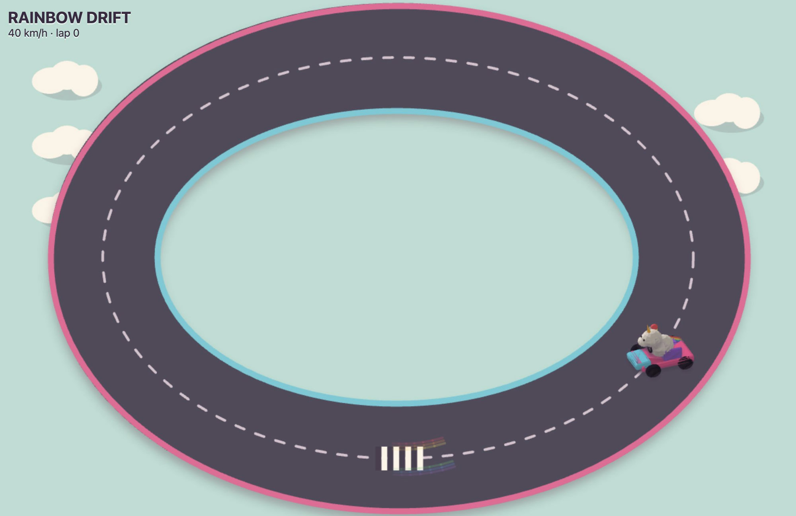

# Rainbow Drift

A tiny browser drifting game featuring a Blender-authored unicorn kart rendered on an HTML canvas. Built for the js13kGames 2026 theme, **Unicorns and Rainbows**.

[Play Rainbow Drift](https://andreagriffiths11.github.io/rainbow-drift/game/) · [Download the 13KB game](https://github.com/AndreaGriffiths11/rainbow-drift/releases/download/v0.1.0/rainbow-drift.zip)



## Controls

- Drive with WASD or the arrow keys.
- Hold a steering key above 35 km/h to drift and charge a boost.
- Release steering to use the boost.
- Press R to restart.
- On a touch screen, use the four on-screen controls.

## Submission package

`rainbow-drift.zip` contains `index.html` and `kart.js` at its top level. It has no external dependencies or network requests.

- Size: **11,505 bytes** of 13,312 bytes
- SHA-256: `5c31c0b8265c7670c93944ab30b005d5b032045aade28597c322453890710b68`

Extract the archive and open `index.html` to play.

## Source

- `game/` contains the dependency-free browser game.
- `rainbow-drift.blend` is the Blender source scene.
- `create_asset.py` rebuilds the Blender scene, preview, and web kart geometry.
- `asset-metrics.json` records the generated scene geometry counts.

## Rebuild and check

```sh
/Applications/Blender.app/Contents/MacOS/Blender -b --python create_asset.py
(cd game && zip -9 -q ../rainbow-drift.zip index.html kart.js)
unzip -t rainbow-drift.zip
```

## License

Copyright (C) 2026 Andrea Liliana Griffiths

Licensed under the GNU Affero General Public License v3.0 only. See [LICENSE](LICENSE).
